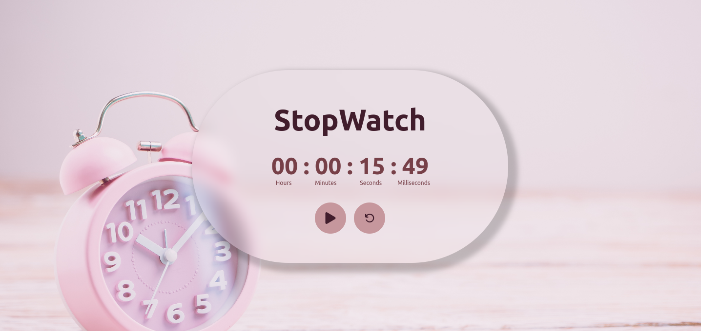

# StopWatch
- Tech Stack - ReactJS, TailwindCSS
- The user can start, pause or reset the stopwatch
- Concepts :
    - useRef Hook - useRef is a React Hook that lets you reference a value that’s not needed for rendering.

# Snapshot 
